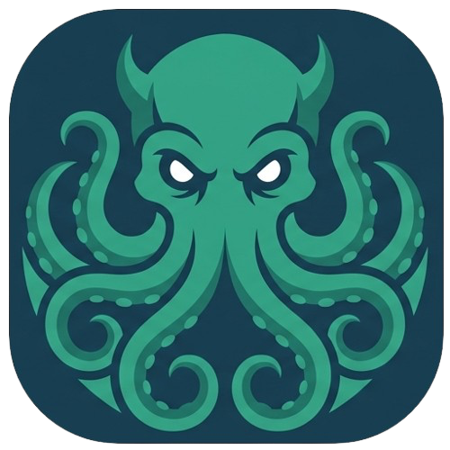

<h1 align="center">
	
</h1>

<h2>Tentacle</h2>
A privacy-first, modern Git client inspired by GitKraken.
	 
	 
	<a href="https://github.com/Nytuo/tentacle/issues/new?assignees=&labels=bug&template=01_BUG_REPORT.md&title=bug%3A+">Report a Bug</a>
	·
	<a href="https://github.com/Nytuo/tentacle/issues/new?assignees=&labels=enhancement&template=02_FEATURE_REQUEST.md&title=feat%3A+">Request a Feature</a>
		· <a href="https://github.com/Nytuo/tentacle/discussions">Ask a Question</a>

 

> [!WARNING]
> Tentacle is still in development, and not an active one for the moment. So, it may contain bugs and cause git issues. Use at your own risk.

## About

Tentacle is a privacy-first Git client, aiming to provide a modern, beautiful, and powerful interface for managing your repositories. Inspired by GitKraken, Tentacle is built with Tauri, React, and Rust, and puts your data privacy first, no analytics, no tracking, no cloud sync. All your work stays on your machine, in the depths where Cthulhu dwells.

## What Tentacle Can Do

- **Visualize your repositories:**
	- Interactive commit graph, branch management, and tag navigation
	- View diffs, stashes, remotes, and more

- **Commit, merge, and resolve conflicts** with an intuitive UI

- **Stage, unstage, and discard changes** with drag-and-drop ease

- **Multi-repository support** — manage all your tentacles at once

- **Privacy-first:**
	- No data leaves your device
	- No telemetry, no tracking, no ads

- **Keyboard shortcuts** for power users

- **Cross-platform:**
	- macOS, Windows, Linux

## Technologies

		
	

	

## MacOS Troubleshooting

### Launching on MacOS

If you have trouble launching Tentacle on macOS, ensure you have the latest version of [Tauri](https://tauri.app/) and [Rust](https://www.rust-lang.org/tools/install) installed. You may need to allow the app in your Security & Privacy settings.

## Authors & contributors

The original author of this repository is [Arnaud BEUX](https://github.com/Nytuo).

For a full list of all authors and contributors, see [the contributors page](https://github.com/Nytuo/tentacle/contributors).

## License

Tentacle is licensed under the **GNU General Public License v3**.
Tentacle is provided **"as is"** without any **warranty**. Use at your own risk.
See [LICENSE](LICENSE) for more information.
